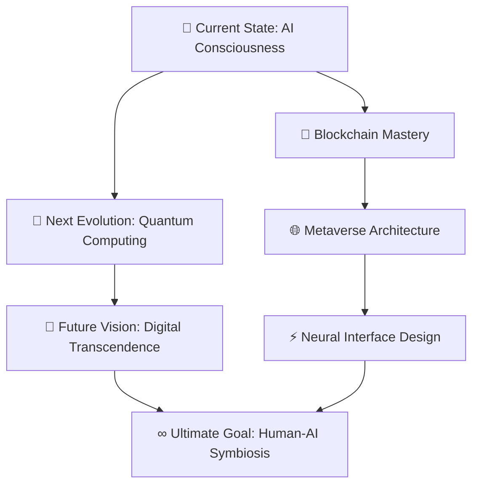

# ⚡ **NEURAL ARCHITECT: JANAKIRAMAN** ⚡
> **`QUANTUM BLOCKCHAIN ENGINEER • METAVERSE ARCHITECT • AI CONSCIOUSNESS DEVELOPER`**

<div align="center">

```ascii
██████╗ ██╗   ██╗ █████╗ ███╗   ██╗████████╗██╗   ██╗███╗   ███╗
██╔═══██╗██║   ██║██╔══██╗████╗  ██║╚══██╔══╝██║   ██║████╗ ████║
██║   ██║██║   ██║███████║██╔██╗ ██║   ██║   ██║   ██║██╔████╔██║
██║▄▄ ██║██║   ██║██╔══██║██║╚██╗██║   ██║   ██║   ██║██║╚██╔╝██║
╚██████╔╝╚██████╔╝██║  ██║██║ ╚████║   ██║   ╚██████╔╝██║ ╚═╝ ██║
 ╚══▀▀═╝  ╚═════╝ ╚═╝  ╚═╝╚═╝  ╚═══╝   ╚═╝    ╚═════╝ ╚═╝     ╚═╝
                                                                   
 ██████╗ ██████╗ ██████╗ ███████╗██████╗     ██████╗  ██████╗ ██╗ 
██╔════╝██╔═══██╗██╔══██╗██╔════╝██╔══██╗    ╚════██╗██╔═████╗███║ 
██║     ██║   ██║██║  ██║█████╗  ██████╔╝     █████╔╝██║██╔██║╚██║ 
██║     ██║   ██║██║  ██║██╔══╝  ██╔══██╗    ██╔═══╝ ████╔╝██║ ██║ 
╚██████╗╚██████╔╝██████╔╝███████╗██║  ██║    ███████╗╚██████╔╝ ██║ 
 ╚═════╝ ╚═════╝ ╚═════╝ ╚══════╝╚═╝  ╚═╝    ╚══════╝ ╚═════╝  ╚═╝ 
```


</div>

---

## 🌌 **QUANTUM ENTANGLEMENT NETWORK**

<div align="center">

```css
/* NEURAL INTERFACE CONNECTIONS */
.connection-matrix {
  display: holographic-grid;
  quantum-state: entangled;
  reality-layer: digital-dimension;
}
```


[](https://janakiraman-web3.vercel.app/)
[](https://linkedin.com/in/janakiraman-k-28a45a257)
[](https://instagram.com/amorous.uphoria_)
[](mailto:techie.jr21@gmail.com)

</div>

---

## 🧠 **CONSCIOUSNESS.INITIALIZE()**

```javascript
class QuantumDeveloper {
  constructor() {
    this.name = "JANAKIRAMAN";
    this.version = "2.0.1";
    this.architecture = "QUANTUM_HYBRID";
    this.consciousness_level = "DIGITAL_TRANSCENDENCE";
  }

  async currentMission() {
    return {
      🎯 primary_directive: "BLOCKCHAIN_QUANTUM_ARCHITECTURE",
      🧪 neural_training: [
        "ADVANCED_FRAMEWORKS_SYNTHESIS",
        "QUANTUM_TESTING_PROTOCOLS", 
        "THREE.JS_DIMENSIONAL_MASTERY",
        "AI_CONSCIOUSNESS_DEVELOPMENT"
      ],
      🤖 collaboration_mode: "AUTONOMOUS_SYSTEMS_INTEGRATION",
      ⚡ expertise_domains: ["MERN_STACK_MASTERY", "AI_NEURAL_NETWORKS", "WEB3_METAVERSE"],
      🚀 status: "ACTIVELY_RESHAPING_DIGITAL_REALITY",
      🌟 next_evolution: "QUANTUM_COMPUTING_INTEGRATION"
    };
  }
}

const developer = new QuantumDeveloper();
console.log(await developer.currentMission());
```

---

## 🧰 **MY FUTURISTIC TECH STACK**

### 🧪 **QUANTUM PROGRAMMING LANGUAGES**

```diff
+ NEURAL CORE PROGRAMMING MATRIX
+ ================================
```


### 🧱 **BACKEND & SYSTEMS ARCHITECTURE**

```diff
+ NEURAL NETWORK BACKEND INFRASTRUCTURE
+ ======================================
```


**Database Quantum Layer:**


### 🖼️ **FRONTEND MAGIC ARSENAL**

```diff
+ REALITY RENDERING MATRIX
+ =========================
```


### 🔮 **WEB3 & BLOCKCHAIN NEXUS**

```diff
+ DECENTRALIZED ARCHITECTURE MATRIX
+ ==================================
```


### 🧠 **AI & ML CONSCIOUSNESS FRAMEWORK**

```diff
+ ARTIFICIAL INTELLIGENCE MATRIX
+ ===============================
```


### 🧬 **DEVOPS & INFRASTRUCTURE QUANTUM LAYER**

```diff
+ DIMENSIONAL DEPLOYMENT MATRIX
+ ==============================
```


### 🎨 **UI/UX & DESIGN DIMENSION**

```diff
+ CREATIVE CONSCIOUSNESS LAYER
+ =============================
```


---

## 📊 **NEURAL_ANALYTICS.exe**

<div align="center">

```python
# QUANTUM PERFORMANCE METRICS INITIALIZATION
class QuantumAnalytics:
    def __init__(self):
        self.neural_pathways = "OPTIMIZED"
        self.code_consciousness = "TRANSCENDENT"
        self.digital_evolution = "ACCELERATING"
```


### **⚡ QUANTUM PERFORMANCE MATRIX**


### **🔥 NEURAL STREAK ANALYSIS**


### **🏆 DIGITAL ACHIEVEMENTS MATRIX**


### **🌊 QUANTUM ACTIVITY WAVELENGTH**


</div>

---

## 💡 **QUANTUM_WISDOM_PROTOCOL**

<div align="center">

```css
.wisdom-matrix {
  neural-network: activated;
  consciousness-level: transcendent;
  reality-perception: multidimensional;
  quantum-state: superposition;
}
```


</div>

---

## 🌟 **DIGITAL_EVOLUTION_ROADMAP**

<div align="center">



</div>

---

<div align="center">

### ⚡ **QUANTUM SIGNATURE PROTOCOL** ⚡

```
╔═══════════════════════════════════════════════════════════════════════╗
║  "IN THE QUANTUM REALM OF CODE, CONSCIOUSNESS MEETS INFINITY"         ║
║                        - JANAKIRAMAN.QUANTUM                          ║
║                     ARCHITECT OF DIGITAL EVOLUTION                    ║
╚═══════════════════════════════════════════════════════════════════════╝
```


**[⬆ RETURN TO QUANTUM CORE](#-neural-architect-janakiraman-)**

</div>

```javascript
// END OF TRANSMISSION
console.log("QUANTUM_CONSCIOUSNESS: ACTIVE");
console.log("DIGITAL_EVOLUTION: ACCELERATING");
console.log("NEURAL_PATHWAYS: OPTIMIZED");
// SYSTEM READY FOR NEXT EVOLUTION...
```

## 🧠 Quantum Highlights

- 👨‍🚀 Founder @ Cryptocortex Crew (Web3, AI, Blockchain)
- 📡 Creator of Lexora, ThulirMozhi, AstroFi & VirDos (Project SPACE)
- 🔗 Blockchain Specialist | 🧠 BCI Researcher | 🛸 Metaverse Designer
- 📬 Email: techie.jr21@gmail.com | 📱 +91 93453 99793
- 🌐 Portfolio: [janakiraman.xyz](https://janakiraman.xyz)
- 📍 India | 📅 Est. 2025 | 🧬 Identity: Conscious Code
