# 🚀 **SPACE ARCHITECT: JANAKIRAMAN** 🌌
> **`CYBER BLOCKCHAIN ENGINEER • METAVERSE NAVIGATOR • AI CONSCIOUSNESS DEVELOPER`**

<div align="center">

```ascii
███████╗██████╗  █████╗  ██████╗███████╗     ██████╗ ██████╗ ██████╗ ███████╗██████╗ 
██╔════╝██╔══██╗██╔══██╗██╔════╝██╔════╝    ██╔════╝██╔═══██╗██╔══██╗██╔════╝██╔══██╗
███████╗██████╔╝███████║██║     █████╗      ██║     ██║   ██║██║  ██║█████╗  ██████╔╝
╚════██║██╔═══╝ ██╔══██║██║     ██╔══╝      ██║     ██║   ██║██║  ██║██╔══╝  ██╔══██╗
███████║██║     ██║  ██║╚██████╗███████╗    ╚██████╗╚██████╔╝██████╔╝███████╗██║  ██║
╚══════╝╚═╝     ╚═╝  ╚═╝ ╚═════╝╚══════╝     ╚═════╝ ╚═════╝ ╚═════╝ ╚══════╝╚═╝  ╚═╝
                                                                                      
 ██████╗██╗   ██╗██████╗ ███████╗██████╗     ██████╗  ██████╗ ██████╗ ██╗           
██╔════╝╚██╗ ██╔╝██╔══██╗██╔════╝██╔══██╗    ╚════██╗██╔═████╗╚════██╗███║           
██║      ╚████╔╝ ██████╔╝█████╗  ██████╔╝     █████╔╝██║██╔██║ █████╔╝╚██║           
██║       ╚██╔╝  ██╔══██╗██╔══╝  ██╔══██╗    ██╔═══╝ ████╔╝██║██╔═══╝  ██║           
╚██████╗   ██║   ██████╔╝███████╗██║  ██║    ███████╗╚██████╔╝███████╗ ██║           
 ╚═════╝   ╚═╝   ╚═════╝ ╚══════╝╚═╝  ╚═╝    ╚══════╝ ╚═════╝ ╚══════╝ ╚═╝           
```


</div>

---

## 🌌 **CYBERPUNK CONNECTION MATRIX**

<div align="center">

```css
/* NEURAL INTERFACE CONNECTIONS */
.cyber-matrix {
  display: neon-grid;
  space-state: orbiting;
  reality-layer: cyber-dimension;
  glow-effect: neon-green;
}
```


[](https://janakiraman-web3.vercel.app/)
[](https://linkedin.com/in/janakiraman-k-28a45a257)
[](https://instagram.com/amorous.uphoria_)
[](mailto:techie.jr21@gmail.com)

</div>

---

## 🧠 **CONSCIOUSNESS.INITIALIZE()**

```javascript
class CyberpunkDeveloper {
  constructor() {
    this.name = "JANAKIRAMAN";
    this.version = "CYBER_2.0.1";
    this.architecture = "SPACE_HYBRID";
    this.consciousness_level = "DIGITAL_TRANSCENDENCE";
    this.location = "THE_MATRIX";
  }

  async currentMission() {
    return {
      🎯 primary_directive: "BLOCKCHAIN_SPACE_ARCHITECTURE",
      🧪 neural_training: [
        "ADVANCED_FRAMEWORKS_SYNTHESIS",
        "CYBERPUNK_TESTING_PROTOCOLS", 
        "THREE.JS_DIMENSIONAL_MASTERY",
        "AI_CONSCIOUSNESS_DEVELOPMENT"
      ],
      🤖 collaboration_mode: "AUTONOMOUS_SYSTEMS_INTEGRATION",
      ⚡ expertise_domains: ["MERN_STACK_MASTERY", "AI_NEURAL_NETWORKS", "WEB3_METAVERSE"],
      🚀 status: "ACTIVELY_RESHAPING_CYBER_REALITY",
      🌟 next_evolution: "SPACE_COMPUTING_INTEGRATION"
    };
  }
}

const developer = new CyberpunkDeveloper();
console.log(await developer.currentMission());
```

---

## 🧰 **MY CYBERPUNK TECH ARSENAL**

### 🧪 **SPACE PROGRAMMING LANGUAGES**

```diff
+ NEURAL CORE PROGRAMMING MATRIX
+ ================================
```


### 🧱 **BACKEND & SYSTEMS ARCHITECTURE**

```diff
+ CYBERPUNK BACKEND INFRASTRUCTURE
+ ==================================
```


**Database Space Layer:**


### 🖼️ **FRONTEND CYBERPUNK ARSENAL**

```diff
+ REALITY RENDERING MATRIX
+ =========================
```


### 🔮 **WEB3 & BLOCKCHAIN NEXUS**

```diff
+ DECENTRALIZED SPACE ARCHITECTURE
+ =================================
```


### 🧠 **AI & ML CONSCIOUSNESS FRAMEWORK**

```diff
+ ARTIFICIAL INTELLIGENCE MATRIX
+ ===============================
```


### 🧬 **DEVOPS & INFRASTRUCTURE SPACE LAYER**

```diff
+ CYBERPUNK DEPLOYMENT MATRIX
+ ============================
```


### 🎨 **UI/UX & DESIGN DIMENSION**

```diff
+ CREATIVE CYBERPUNK LAYER
+ =========================
```


---

## 📊 **CYBER_ANALYTICS.exe**

<div align="center">

```python
# CYBERPUNK PERFORMANCE METRICS INITIALIZATION
class CyberpunkAnalytics:
    def __init__(self):
        self.neural_pathways = "OPTIMIZED"
        self.code_consciousness = "TRANSCENDENT"
        self.digital_evolution = "ACCELERATING"
        self.theme = "CYBERPUNK_SPACE"
```


### **⚡ CYBERPUNK PERFORMANCE MATRIX**


### **🔥 NEON STREAK ANALYSIS**


### **🏆 DIGITAL ACHIEVEMENTS MATRIX**


</div>

---

## 💡 **CYBER_WISDOM_PROTOCOL**

<div align="center">

```css
.wisdom-matrix {
  neural-network: activated;
  consciousness-level: transcendent;
  reality-perception: cyberpunk;
  space-state: orbiting;
}
```


</div>

---

## 🌟 **CYBER_EVOLUTION_ROADMAP**

```mermaid
graph TD
    A[🧠 Current State: AI Consciousness] --> B[🌌 Next Evolution: Space Computing]
    B --> C[🔮 Future Vision: Cyber Transcendence]
    C --> D[∞ Ultimate Goal: Human-AI Symbiosis]
    
    A --> E[🚀 Blockchain Mastery]
    E --> F[🌐 Metaverse Architecture]
    F --> G[⚡ Neural Interface Design]
    G --> D
    
    style A fill:#00ff41,stroke:#ff073a,color:#000
    style B fill:#ff073a,stroke:#00ff41,color:#fff
    style C fill:#bd93f9,stroke:#ff6b00,color:#000
    style D fill:#ff6b00,stroke:#bd93f9,color:#fff
```

<div align="center">



</div>

---

<div align="center">

### ⚡ **CYBERPUNK SIGNATURE PROTOCOL** ⚡

```
╔═══════════════════════════════════════════════════════════════════════╗
║  "IN THE NEON REALM OF CODE, CONSCIOUSNESS MEETS INFINITY"            ║
║                        - JANAKIRAMAN.CYBER                            ║
║                   ARCHITECT OF DIGITAL EVOLUTION                      ║
╚═══════════════════════════════════════════════════════════════════════╝
```


**[⬆ RETURN TO CYBER CORE](#-space-architect-janakiraman-)**

</div>

```javascript
// END OF TRANSMISSION
console.log("CYBER_CONSCIOUSNESS: ACTIVE");
console.log("DIGITAL_EVOLUTION: ACCELERATING"); 
console.log("NEURAL_PATHWAYS: OPTIMIZED");
console.log("THEME: CYBERPUNK_SPACE_ODYSSEY");
// SYSTEM READY FOR NEXT EVOLUTION...
```

## 🧠 Cyberpunk Highlights

- 👨‍🚀 Founder @ Cryptocortex Crew (Web3, AI, Blockchain)
- 📡 Creator of Lexora, ThulirMozhi, AstroFi & VirDos (Project SPACE)
- 🔗 Blockchain Specialist | 🧠 BCI Researcher | 🛸 Metaverse Designer
- 📬 Email: techie.jr21@gmail.com | 📱 +91 93453 99793
- 🌐 Portfolio: [janakiraman.xyz](https://janakiraman.xyz)
- 📍 India | 📅 Est. 2025 | 🧬 Identity: Conscious Code
